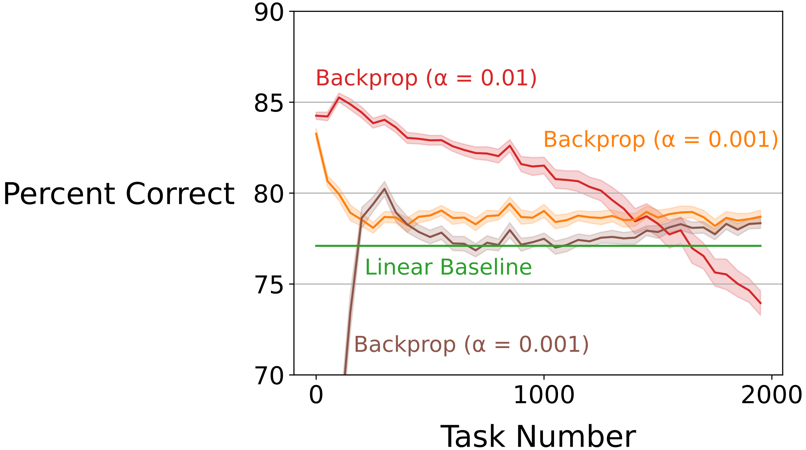

# Loss of Plasticity in Continual Binary ImageNet Classification (CIBC)
This repository contains the implementation of the continual binary ImageNet classification problem.

The first step to replicate the results is to download the data. The data can be downloaded [here](https://drive.google.com/file/d/1i0ok3LT5_mYmFWaN7wlkpHsitUngGJ8z/view?usp=sharing).
Create a directory named `data` and extract the downloaded file in `data`
```sh
mkdir data
python3.8 load_mnist.py
```

The next step is to test a deep convolution network that uses backprop to learn.
The network is specified in `../net/conv_net.py`
This command produces 30 temporary cfg files in `temp_cfg`.

```sh
python3.8 multi_param_expr.py -c cfg/bp/step_size.json 
```

Each of the new temporary cfg files can then be used to do one run of backprop.
```sh
python3.8 expr.py -c temp_cfg/0.json 
```

Finally, after completing all the runs, the command below can be used to generate
the plot for the network specified in `cfg/sgd/bp/step_size.json`.

```sh
python3.8 bp_plot.py -c cfg/bp/step_size.json 
```

The command above will generate the plot below.
The results below are averaged for 30 runs, and accuracy is binned into bins of size 50.



