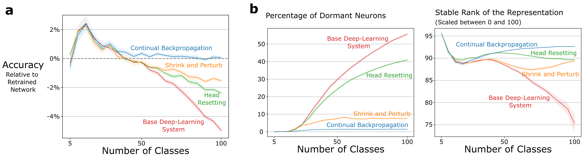
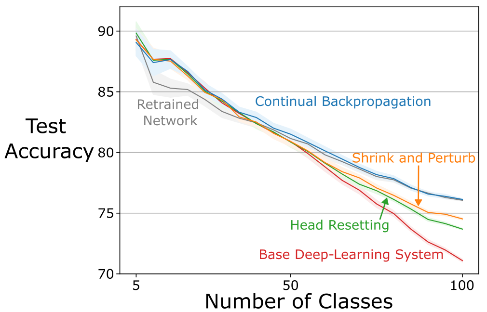

# Loss of Plasticity in Incremental CIFAR-100

This repository contains the implementation of the incremental CIFAR-100 problem, which should
allow for the reproduction of the results in the paper.


### Running the Experiment 

Now you can run the script `incremental_cifar_experiment.py` with any of the config files in `cfg`
to replicate the results of each different algorithm.
The script takes three arguments:

* `--config`: this is a path to a `json` file that defines the parameter values for the experiment.
    We provide config files for each algorithm shown in the paper, but you may also write your own.
    For more details on how to write a config file, see the `README` in the `cfg` directory. 
    **Note:** you might have to adjust is `num_workers` depending on the number of available cpu cores.
* `--experiment-index`: this is a positive integer that determines the random seed for the experiment.
    As long as you use the same index, the results should be identical as long as you run the experiment 
    without any interruptions and on the same hardware.
    More on checkpointing at the end. 
* `--verbose`: indicates whether to print detailed information about the progress of the experiment.
    If enabled, the script will print the train accuracy for every 25 mini-batches and the test and
    validation accuracy for each epoch, as well as the run time for each epoch.
    If disabled, it simply shows a progress bar.
    Note that the estimated time displayed on the progress bar is not very accurate since iterations
    increase in length as new classes are added. 

With this in mind, you can run the experiment for the base deep learning system using the following 
command. A single run with the base deep-learning system takes about 6 hours on an A-100 GPU.

```sh
python3.8 incremental_cifar_experiment.py --config ./cfg/base_deep_learning_system.json --verbose \
--experiment-index 0
```

The first thing that the script will do is download the CIFAR-100 data, which requires an internet 
connection.
The data is stored in the path provided in the config file.
By default, the data is stored in `PATH_TO_DIR/loss-of-plasticity/lop/incremental_cifar/data/`.

As the experiment is running, the script will store checkpoint information and results in a directory
specified in the config file.
By default, the results are stored in `PATH_TO_DIR/loss-of-plasticity/lop/incremental_cifar/results/`

When the script is done running, it would have created a new directory with the name of the experiment,
which is specified in the config file and is by default the name of the `json` file. 
Inside of this directory, there will be several directories corresponding to different metrics.
Each metric directory contains files named `index-${experiment_index}.npy` corresponding to the given
experiment index. 
You can then use these files to reproduce the plots in the paper.

### Post-Run Analysis

The `incremental_cifar_experiment.py` only computes the performance of the learning algorithm, but it
doesn't keep track of other metrics shown in the paper such as the number of dormant neurons or the
stable rank of the representation layer.
To compute this metric, you should run `post_run_analysis.py`, which takes the following arguments

* `--results_dir`: path to the results directory of an experiment.
    By default, this is set to `./loss-of-plasticity/lop/incremental_cifar/results/base_deep_learning_system/`.
* `--data_path`: path to the directory containing the data.
    By default, this is set to `./loss-of-plasticity/lop/incremental_cifar/data/`
* `--dormant_unit_threshold`: a float between 0 and 1 that determines the threshold below which a hidden
    unit is considered dormant.
    By default, this is set to 0.01, the same value as the one used for the paper.

With this in mind, you can run the script for the `base_deep_learning_system` by running the following
line:

```sh
python3.8 post_run_analysis.py --results_dir ./results/base_deep_learning_system/
```

### Reproducing the Plots in the Paper

You can generate the plots found in the paper using the following three commands

```sh
python3.8 ./plots/plot_incremental_cifar_results.py --results_dir ./results/ \
--algorithms base_deep_learning_system,continual_backpropagation,retrained_network \
--metric relative_accuracy_per_epoch
```

The command above requires that you pass `retrained_network` as one of the algorithms because that is
the one used as baseline. 
The command above generates the blue and red lines in the left panel of the figure below: 



Whereas the following two commands generate the blue and red lines in the center and right panels of
the figure above:

```sh
python3.8 ./plots/plot_incremental_cifar_results.py --results_dir ./results/ \
--algorithms base_deep_learning_system,continual_backpropagation \
--metric next_task_dormant_units_analysis


python3.8 ./plots/plot_incremental_cifar_results.py --results_dir ./results/ \
--algorithms base_deep_learning_system,continual_backpropagation \
--metric next_task_stable_rank_analysis
```

Finally, to plot the raw accuracies for the base deep learning system, continual backprop, and 
retrained network baseline use the following command:

```sh
python3.8 ./plots/plot_incremental_cifar_results.py --results_dir ./results/ \
--algorithms base_deep_learning_system,continual_backpropagation,retrained_network \
--metric test_accuracy_per_epoch
```



The plots may not look exactly the same as in the paper because of differences in hardware and package
versions.
However, with enough samples, you should see close to the same pattern as in the paper. 

### Notes on Checkpointing

The script generates checkpoints every 200 epochs, so you can stop and restart the experiment later.
However, when using a gpu, there is no guarantee that you will get exactly the same results when
restarting an experiment from a checkpoint.
Thus, if you want to be able to replicate your own results exactly, you should run the script without
interruptions.
In the end, even when the results are not reproduced exactly, the results should still look very
similar to the results shown in the paper. 


