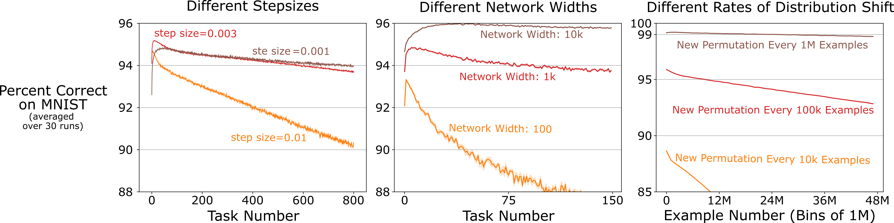

# Loss of Plasticity in Online Permuted MNIST
This repository contains the implementation of the online Permuted MNIST problem.

The first step to replicate the results is to download the data.

```sh
mkdir data
python3.8 load_mnist.py
```

The next step is to test a learning network that uses backprop to learn.
This command produces 10 temporary cfg files in `temp_cfg`.

```sh
python3.8 multi_param_expr.py -c cfg/bp/std_net.json 
```

Each of the new temporary cfg files can then be used to do one run of backprop.
```sh
python3.8 expr.py -c temp_cfg/0.json 
```

Finally, after completing all the runs, the command below can be used to generate
the plot for the network specified in `cfg/bp/std_net.json`.

```sh
cd plots
python3.8 bp_metrics.py --cfg_file ../cfg/bp/std_net.json --metric accuracy
```

The command above will generate the plot on the left below.
I have found the variance among individual runs to be surprisingly small.
Just one run can be used for quick prototyping.



Similar process can be followed to test other methods like L2 regularization using the config
files specified in `cfg/`.
Some internals like the average weight magnitude of the network can be plotted by changing
the `metric` argument in the command. 
These config files reproduce the results in Figure 6 of the [paper](https://arxiv.org/abs/2306.13812). 