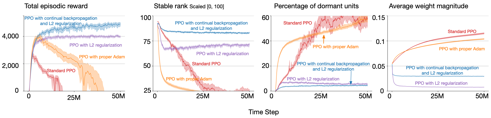

# Loss of plasticity in reinforcement learning

This directory contains the code to demonstrate and mitigate loss of plasticity in reinforcement learning problems from the OpenAI [Gym](https://www.gymlibrary.dev/index.html).
The actor and critic networks are specified in [`../net/policies.py`](../nets/policies.py) and [`../net/valuesf.py`](../nets/valuefs.py) respectively.

The configurations for individual experiments can be found in [`cfg`](cfg). [`cfg/ant/std.yml`](cfg/ant/std.yml) specifies the parameters for _standard PPO_ in the _Ant-v3_ environment.
The following command can be used to perform one run for this configuration file. The `-s` parameter specifies the random seed for the experiment. 
A single run (for 50M time-steps) on a normal laptop takes about 24 CPU-hours.

```sh
python3.8 run_ppo.py -c cfg/ant/std.json -s 0
```

Configuration files in [`cfg/ant/ns.yml`](cfg/ant/ns.yml), [`cfg/ant/l2.yml`](cfg/ant/l2.yml), and [`cfg/ant/cbp.yml`](cfg/ant/cbp.yml)specify the parameters for
PPO with proper Adam, PPO with L2 regularization, and PPO with continual backpropagation respectively.

After completing 30 runs for the four configuration files specified above, the commands below can be used to plot the left figure below.
The generated figures will be in the [`plots`](plots) directory.
```sh
cd plots/
python3.8 fig4a.py 
```


