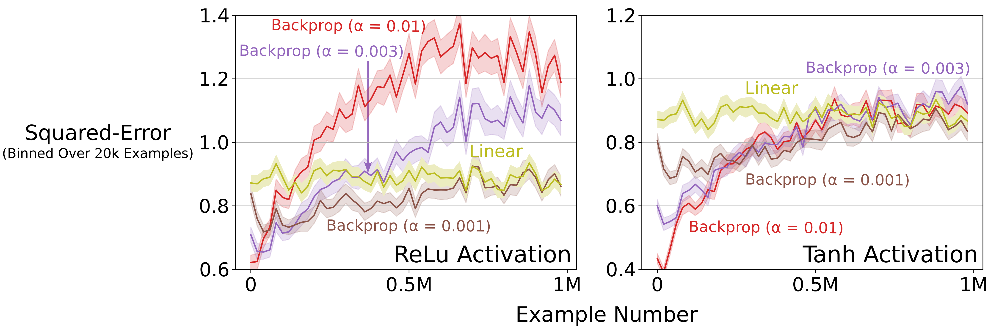

# Loss of Plasticity in Slowly Changing Regression Problem
This repository contains the implementation of the slowly changing regression problem, 
previously known as the bit-flipping problem.

The first step to replicate the results is to create the data.

```sh
cd lop/slowly_changing_regression
mkdir env_temp_cfg temp_cfg
python3.8 multi_param_expr.py -c cfg/prob.json 
```
This step creates 100 temporary cfg files in `env_temp_cfg`,
as `cfg/prob.json` specifies 100 runs.
Each of the new temporary cfg files can then be used to generate data using `slowly_changing_regression.py`.
The command below creates data for one run.

```sh
python3.8 slowly_changing_regression.py -c env_temp_cfg/0.json 
```

The next step is to test a learning network that uses backprop to learn.
This command produces 100 temporary cfg files in `temp_cfg`.

```sh
python3.8 multi_param_expr.py -c cfg/sgd/bp/relu.json 
```

To test continual backprop, use a different cfg file, like `cfg/sgd/cbp/relu.json`

Each of the new temporary cfg files can then be used to do one run of backprop. Each run takes about 15 CPU-minutes on a normal laptop.
```sh
python3.8 expr.py -c temp_cfg/0.json 
```

Finally, after completing all the runs, the command below can be used to generate the plot for the ReLU network.
```sh
cd plots
python3.8 online_performance.py -c ../cfg/sgd/bp/relu.json 
```

The command above will generate the figure in the left pane of the plot below.
The plot below shows the performance averaged over 100 runs. 
I recommend doing at least 30 runs, as there can be a high variance among individual runs.
The plot below bins the error into bins of size 20000.


